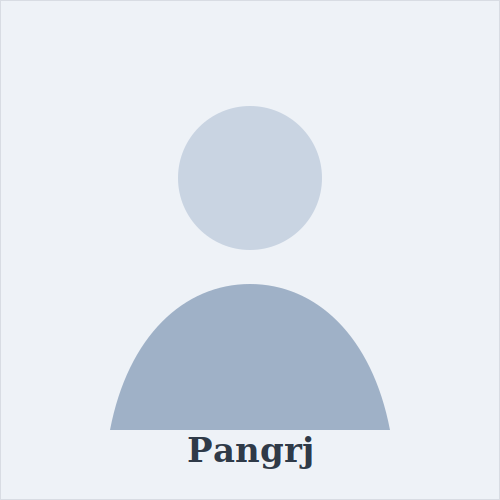
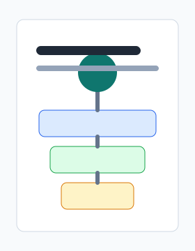

<main class="page">
  <section class="profile">
    

      <h1>Pangrj</h1>
      
Researcher

      
Beihang University

      

        Email: 
        <a href="mailto:pangrj@buaa.edu.cn">pangrj@buaa.edu.cn</a>
      

      

        [<a href="#" aria-label="Google Scholar">Google Scholar</a>]
        [<a href="#" aria-label="ORCID">ORCID</a>]
        [<a href="https://github.com/pangrj" aria-label="GitHub">GitHub</a>]
      

    

    
  </section>

  <section class="section bio">
    <h2>Short Bio</h2>
    

      Pangrj is a researcher at <a href="https://www.buaa.edu.cn/">Beihang University</a>.
      His research interests include artificial intelligence, data-driven modeling,
      and intelligent systems. He is interested in building practical AI methods
      that connect computational models with real-world scientific and engineering problems.
    

    

      This homepage collects selected publications and research outputs. More details
      will be added as the publication list is updated.
    

  </section>

  <section class="section">
    <h2>Publications</h2>
    

      <article class="pub-card">
        
        

          <h3 class="pub-title">From Embodied AI to Cobodied AI</h3>
          
<strong>Pangrj</strong> et al.

          
ScienceDirect article, 2026

          

            <a href="https://www.sciencedirect.com/science/article/pii/S2096579626000161">Paper</a>
            <a href="#">Code</a>
            <a href="#">Project</a>
          

        

      </article>

      <article class="pub-card">
        
        

          <h3 class="pub-title">Selected Publication Title</h3>
          
<strong>Pangrj</strong>, Coauthor A, Coauthor B

          
Conference or Journal, Year

          

            <a href="#">Paper</a>
            <a href="#">Code</a>
          

        

      </article>

      <article class="pub-card">
        
        

          <h3 class="pub-title">Selected Publication Title</h3>
          
<strong>Pangrj</strong>, Coauthor A, Coauthor B

          
Conference or Journal, Year

          

            <a href="#">Paper</a>
            <a href="#">Project</a>
          

        

      </article>
    

  </section>
</main>
